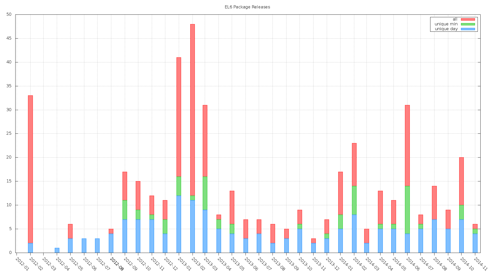

Histogram of PuppetLabs' package releases for EL6
=================================================

This is a histogram of the release (or creation) timestamps of Puppetlabs' RPM
packages for EL6 "binned" by month.  There are three different representations.

1. The timestamp of each individual package (1 minute resolution)
2. Unique timestamps by minute; Eg., if 5 packages have equivalent timestamps
   (at 1 minute resolution) they are combined into a single data point
3. Unique timestamps by day



Data Collection
---------------

The presumed release timestamps were obtained by collecting the `mtime` of RPM
files in an internal mirror at noao.edu of the official Puppetlabs' `products`
and `dependencies` yum repos for the `x64_64` architecture.

The mirror is maintained by this crontab entry that has been in use for many
years (and really should be replaced with pulp).

```
10 * * * * /usr/bin/rsync -avlH --delete --exclude "SRPMS/" yum.puppetlabs.com::packages/yum/ /repo/mirrors/puppetlabs > /dev/null 2>&1
```

The methodology of using `mtime` to represent the package creation epoch is
fundamentally flawed in several ways:

* It is possible, even probable, that the `mtime` is changed between when when
  the RPM is generated and exposed as part of a yum repo.
* The `mtime` can change after a package is part of a repo due to copying,
  backup restoration, etc.
* There's no way to know the timezone or skew of the system clock used to
  generate the timestamp; and
* Packages may have been generated on multiple systems with clocks offset
  relative to each other

The first two defects in the `mtime` method could be eliminated by extracting
timestamp information directly from the packages.  However, the apparent
distribution in the histogram is in line with initial expectations so a more
rigorous approach has not been tested.

The `mtime`s were collected with these commands:
```
find /repo/mirrors/puppetlabs/el/6/{products,dependencies}/x86_64/ -maxdepth 1 -type f -name "*.rpm" | xargs ls -ltr --time-style=long-iso | awk '{ print $6 "T" $7 }'  > el6-all.txt
find /repo/mirrors/puppetlabs/el/6/{products,dependencies}/x86_64/ -maxdepth 1 -type f -name "*.rpm" | xargs ls -ltr --time-style=long-iso | awk '{ print $6 "T" $7 }' | uniq > el6-by_min.txt
find /repo/mirrors/puppetlabs/el/6/{products,dependencies}/x86_64/ -maxdepth 1 -type f -name "*.rpm" | xargs ls -ltr --time-style=long-iso | awk '{ print $6 }' | uniq > el6-by_day.txt
```

Plot Generation
---------------

The venerable [`gnuplot`](http://www.gnuplot.info/) package version `gnuplot
4.6 patchlevel 3` was used to generate the plot.

No example of "binning" a histogram by Gregorian calendar months, without
external pre-processing, in `gnuplot` could be identified.  The method that was
developed to achieve this using gnuplot is possibly novel, was developed in the
early hours of the day before caffeine ingestion and has not been independently
verified to be correct.

These links were useful in developing the "binning" technique:

* http://psy.swansea.ac.uk/staff/carter/gnuplot/gnuplot_time_histograms.htm
* https://stackoverflow.com/questions/2471884/histogram-using-gnuplot
* http://www.phyast.pitt.edu/~zov1/gnuplot/html/histogram.html
* https://aazza.github.io/2014/08/18/generating-sequence-of-histograms-using-gnuplot/
* http://www.inference.eng.cam.ac.uk/teaching/comput/C++/examples/gnuplot/index.shtml
* http://gnuplot.info/docs_4.2/gnuplot.html#x1-27600043.67

Blame
-----

This was developed in a couple of [early morning] hours on 2014-11-20 & -21.

Joshua Hoblitt <jhoblitt@cpan.org> | ^conner @ freenode
